# web 图像处理 - 从零实现一个照片编辑器

## 项目介绍

### 关键词

imageData、canvas、 图像处理、滤镜、裁剪

### 背景介绍

本文通过 canvas 的 ImageData， 实现了一个基础的图像处理工具。可以在浏览器对图片进行左右镜像、左右旋转、颜色滤镜、尺寸修改等操作。

### 功能介绍

逛 github 热榜的时候看到一个项目 [visualization-collection](http://hepengwei.cn/#/gameImage), 里面有很多的前端视觉效果。其中有一个图片处理的项目（[体验地址](http://hepengwei.cn/#/gameImage)），实现了对图片的滤镜、翻转、旋转等功能，感觉是个很有用的功能，所以尝试进行学习和理解。最终实现一个基础版的图像裁剪工具。

### 效果图


### 体验地址

[在线体验](https://mamumu123.github.io/img-generate/cut)

### 代码仓库

[img-generate
](https://github.com/mamumu123/img-generate)(都点进去了，就帮我点个免费的 star 吧🥰)

## 流程知识点(API)介绍

### 处理流程

在浏览器中 ，图片本身是无法被修改的。如果想要处理图像（Image)，可以通过转化成 Canvas 来实现。

```mermaid
graph LR
A[Image] --转化--> B[Canvas]
B --图像处理--> C[新的 Canvas]
C --转化--> D[新的 Image]

```



### image 和 canvas 的相互转化

image 和 canvas 之间是可以相互转化的

#### image -> canvas

通过 `drawImage` 可以实现

```js
// 将图片绘制到画布上
ctx.drawImage(image, 0, 0);
```

#### canvas -> image

Canvas API 中的 `toDataURL` 和 `toBlob` 方法都可以将 `Canvas` 转换为图片

方法 1: 通过 `toDataURL` 实现: 可以直接用于显示图片或将图片上传到服务器

```js
// 将画布转换为base64格式的图片
const dataURL = canvas.toDataURL();
// 赋值给 Image
const newImg = document.createElement('img');
newImg.src = dataURL;
```

方法 2: 通过 `toBlob` 实现: 可以用于将图片保存到本地或上传到服务器

```js
const canvas = document.getElementById('myCanvas');
canvas.toBlob((blob) => {
  const url = URL.createObjectURL(blob);

  // 实现下载功能
  const a = document.createElement('a');
  a.href = url;
  a.download = 'myImage.png';
  a.click();
  URL.revokeObjectURL(url);
}, 'image/png');
```

### Canvas 修改（getImageData）

在知道 Image 和 Canvas 如何转化以后，接下来就看如何对 Canvas 进行修改。这里就需要再了解一个 API [getImageData](https://developer.mozilla.org/zh-CN/docs/Web/API/CanvasRenderingContext2D/getImageData)。

#### ImageData

`getImageData` 返回一个 ImageData 对象，用来描述 Canvas 区域隐含的像素数据。

```js
// 这个区域通过矩形表示，起始点为*(sx, sy)、宽为sw、高为sh
ImageData ctx.getImageData(sx, sy, sw, sh);
// eg: ImageData { width: 100, height: 100, data: Uint8ClampedArray[40000] }
```

返回值是一个对象，其中的 width 和 height 表示区域的宽、高。接下来看一下 data:

> ImageData.data: \[Uint8ClampedArray] 描述了一个一维数组，包含以 `RGBA` 顺序的数据，数据使用 0 至 255（包含）的整数表示。

我们来做一个 demo, 比如我画一个 `2 * 2`的 Canvas, 分别填充四种颜色：

```js
// 设置画布大小为2*2
canvas.width = 2;
canvas.height = 2;

// 绘制四个点位的颜色
ctx.fillStyle = 'red';
ctx.fillRect(0, 0, 1, 1);

ctx.fillStyle = 'green';
ctx.fillRect(1, 0, 1, 1);

ctx.fillStyle = 'blue';
ctx.fillRect(0, 1, 1, 1);

ctx.fillStyle = 'white';
ctx.fillRect(1, 1, 1, 1);

// 将画布转换为base64格式的图片并打印到控制台
const imageData = ctx.getImageData(0, 0, 2, 2) as ImageData;
console.log(imageData);
```

展示的效果像这样： 

能看到 data 的返回值是一个数组，每 4 位描述一个像素点。分别表示红色（Red）、绿色（Green）、蓝色（Blue）和透明度（Alpha）四个通道的值，每个通道的值范围为 0 到 255，表示该通道的颜色强度。其中，透明度通道的值为 0 表示完全透明，255 表示完全不透明。 data 的总长度就是 `width * height * 4`。

通过四个通道数值的变化，就可以描述像素点的颜色值。 

体验地址: [三原色合成](https://mamumu123.github.io/img-generate/red)

那我们通过修改 ImageData，就可以实现图像处理。如果我们想修改到原图，就调用 `putImageData`；如果我们想要生成一个新的 Image，就使用 `ImageData` 新建一个 Canvas。

## 基础操作效果实现

通过对 `ImageData` 的数据变换，我们可以实现一些基础的图像处理：

*   基本滤镜：单色滤镜
*   旋转、镜像
*   灰化
*   锐化

我们来选取一些进行实现。

### 红色滤镜

红色滤镜,就是在 `RGB` 通道中仅保留红色通道的数值,而将其他颜色通道的数值设置为 0。

```ts
// 红色滤镜
const toRed = (imageData: ImageData) => {
  const { data, width, height } = imageData;
  // 新建一个数组，长度和 imageData 保持一致。
  const newImgData = new Uint8ClampedArray(data.length);

  for (let y = 0; y < height; y++) {
    for (let x = 0; x < width; x++) {
      // TODO something
    }
  }
  // 新建一个 ImageData 返回
  return new ImageData(newImgData, width, height);
};
```

一个像素对应 4 个通道，红、绿、蓝、透明度通道。对于每一个像素，我们就需要设置四个元素的值。

```js
// startIndex 对应的则是 a[y][x] 的像素点
const startIndex = (y * width + x) * 4;
// 只保留 R 通道
newImgData[startIndex] = data[startIndex];
// G 和 B 通道设置为 0
newImgData[startIndex + 1] = 0;
newImgData[startIndex + 2] = 0;
newImgData[startIndex + 3] = data[startIndex + 3];
```

效果如图：


同理，蓝色滤镜，黄色滤镜，红蓝色滤镜等都是一样的实现逻辑，只需要保留对应颜色通道的数值。将其他颜色通道的数字设置为 0 就可以了。

### 灰化

图片的灰化是指将彩色图片转换为黑白灰度图像的过程。将彩色图片转换为灰度图像的过程通常使用加权平均法来计算每个像素的亮度值。加权平均法将每个像素的红、绿、蓝三个通道的值按照一定的权重进行加权平均，得到一个亮度值。通常使用以下公式来计算每个像素的亮度值：

```js
L = 0.299 * R + 0.587 * G + 0.114 * B;
```

那么灰化对应的元素修改则是：

```js
const startIndex = (y * width + x) * 4;
// 设置为中间值
const avgColor =
  0.299 * data[startIndex] +
  0.587 * data[startIndex + 1] +
  data[startIndex + 2] * 0.114;
newImgData[startIndex] = avgColor;
newImgData[startIndex + 1] = avgColor;
newImgData[startIndex + 2] = avgColor;
newImgData[startIndex + 3] = data[startIndex + 3];
```

效果如下：


### 左右镜像

左右镜像是指将一个图像在左右方向上进行水平翻转，得到新的图像。也就是说，将一个图像按照中心垂直线对称，并将左右两侧完全重合，就可以得到左右镜像。要实现左右镜像，则需要进行位置变换 `a[y][x] = a[y][width - 1 - x]`

```js
// a[y][x] = a[y][width - 1 - x];
// xxYxxxxxxxxxxxxxxxxxxxxxxxxxxxxxxxxxxxYxx
// startIndex 对应的则是 a[y][x] 的像素点
const startIndex = (y * width + x) * 4;
newImgData[startIndex] = data[(y * width + width - x - 1) * 4]; //
newImgData[startIndex + 1] = data[(y * width + width - x - 1) * 4 + 1];
newImgData[startIndex + 2] = data[(y * width + width - x - 1) * 4 + 2];
newImgData[startIndex + 3] = data[(y * width + width - x - 1) * 4 + 3];
```

效果如图：


### 上下镜像

上下镜像是指将一个图像按照中心水平线对称，并将上下两侧完全重合，从而得到镜像结果。要实现上下镜像，则需要进行位置变换 `a[y][x] = a[height -1 - y][x]`

```js
const startIndex = (y * width + x) * 4;
newImgData[startIndex] = data[((height - y - 1) * width + x) * 4];
newImgData[startIndex + 1] = data[((height - y - 1) * width + x) * 4 + 1];
newImgData[startIndex + 2] = data[((height - y - 1) * width + x) * 4 + 2];
newImgData[startIndex + 3] = data[((height - y - 1) * width + x) * 4 + 3];
```

效果如图：


### 向左旋转 90 度

要实现向左旋转 90 度，则需要进行位置变换 `a[x * height + y] = a[y * width + width - x - 1]`

```js
/*
1 2 3    
4 5 6
7 8 9
=》
3 6 9
2 5 8
1 4 7
*/
const startIndex = (x * height + y) * 4;
newImgData[startIndex] = data[(y * width + width - x - 1) * 4];
newImgData[startIndex + 1] = data[(y * width + width - x - 1) * 4 + 1];
newImgData[startIndex + 2] = data[(y * width + width - x - 1) * 4 + 2];
newImgData[startIndex + 3] = data[(y * width + width - x - 1) * 4 + 3];
```

效果如下：


### 向右旋转 90 度

要实现向右旋转 90 度，则需要进行位置变换 `a[x * height + y] = a[(height - y - 1) * width + x]`

```js
/*
1 2 3    
4 5 6
7 8 9
=》
7 4 1
8 5 2
9 6 3
*/
const startIndex = (x * height + y) * 4;
newImgData[startIndex] = data[((height - y - 1) * width + x) * 4];
newImgData[startIndex + 1] = data[((height - y - 1) * width + x) * 4 + 1];
newImgData[startIndex + 2] = data[((height - y - 1) * width + x) * 4 + 2];
newImgData[startIndex + 3] = data[((height - y - 1) * width + x) * 4 + 3];
```

效果如下：


### 锐化

锐化用于增强图像的边缘和细节，使图像更加清晰和鲜明。在数字图像处理中，锐化技术通常通过卷积运算来实现。卷积运算是一种基于滤波器的图像处理技术，它通过将一个滤波器应用于图像的每个像素，来改变图像的亮度和颜色。

```js
// -1 -1 -1
// -1  9 -1
// -1 -1 -1
const kernel = [-1, -1, -1, -1, 9, -1, -1, -1, -1]; // 锐化卷积核
const newImageData = convolutionMatrix(imageData, kernel);
```

卷积矩阵的实现

```js
const startIndex = (y * width + x) * 4;
for (let i = 0; i < 3; i++) {
  const index = startIndex + i;
  // 边缘不处理，直接设置为原始值
  if (x === 0 || x === width - 1 || y === 0 || y === height - 1) {
    newImgData[index] = data[index];
  } else {
    // 每个点等于所在的 8 邻域的 3 * 3 矩阵和卷积核（kernel）对应位置相乘再相加
    newImgData[index] =
      kernel[0] * data[index - width * 4 - 4] + // 左上角
      kernel[1] * data[index - width * 4] + // 上方 width * 4 = 一行的数据数量
      kernel[2] * data[index - width * 4 + 4] +
      kernel[3] * data[index - 4] + // 左侧
      kernel[4] * data[index] + // 当前
      kernel[5] * data[index + 4] +
      kernel[6] * data[index + width * 4 - 4] +
      kernel[7] * data[index + width * 4] +
      kernel[8] * data[index + width * 4 + 4];
  }
}
newImgData[startIndex + 3] = data[startIndex + 3];
```

效果如下：


## 裁剪功能实现

裁剪功能分成2部分，分别是：

*   设置裁剪参数： x、y、width、height
*   下载指定范围的图像

### 设置裁剪参数

设置参数通过有两种方式，一个是增加表单，通过表单来填写参数；另一种是更加可视化的拖拽方式。第一种比较简单，我们来看看如何实现拖拽方式修改参数。

*   矩形蒙层
*   拖拽功能
*   放大缩小功能

#### 矩形蒙层

我们在预览 canvas 上方

```js
// 遮罩层绘制
useEffect(() => {
  const canvas = maskCanvasRef.current;
  const ctx = canvas?.getContext('2d');
  if (!ctx || !originData) {
    return;
  }
  // 绘制之前先清除全部
  ctx.clearRect(0, 0, originData?.width, originData?.height);
  
  // 如果开启裁剪功能
  if (startCrop) {

    // 设置全部蒙层，将范围内的蒙层去掉，表示裁剪范围；
    ctx.fillStyle = 'rgba(125, 125, 125, 0.5)';
    ctx.fillRect(0, 0, originData?.width, originData?.height);
    ctx.clearRect(cx, cy, cWidth, cHeight);
  }
}, [startCrop, cx, cy, cWidth, cHeight, originData]);
```

我们还可以在矩形每条边的中点， 绘制一下圆形，用来进行放大缩小：

```js
// Draw circles at the midpoint of each edge
const circleRadius = 10;
const midPoints = [
  { x: cx + cWidth / 2, y: cy }, // Top
  { x: cx + cWidth, y: cy + cHeight / 2 }, // Right
  { x: cx + cWidth / 2, y: cy + cHeight }, // Bottom
  { x: cx, y: cy + cHeight / 2 }, // Left
];

midPoints.forEach((point) => {
  ctx.beginPath();
  ctx.arc(point.x, point.y, circleRadius, 0, 2 * Math.PI);
  ctx.lineWidth = 5;
  ctx.strokeStyle = 'red';
  ctx.stroke();
});
```

### 拖拽功能

为了实现拖拽功能，我们首先需要对 canvas 进行事件监听 `onMouseDown`, 'onMouseUp', 'onMouseMove'

```js
  <canvas
    ref={maskCanvasRef}
    className={styles.mask__canvas}
    onMouseDown={handleMouseDown}
    onMouseUp={handleMouseUp}
    onMouseMove={handleMouseMove}
  />
```

在handleMouseDown函数中，我们判断鼠标是否在矩形框内，如果是，则设置 `dragging = true` 说明可以拖拽。

```js
  const handleMouseDown = (e: React.MouseEvent<HTMLCanvasElement>) => {
    const { x, y } = getCanvasMousePosition(canvasRef.current!, e);

    // Check if the mouse is inside the rectangle
    if (x >= cx && x <= cx + cWidth && y >= cy && y <= cy + cHeight) {
      setDragging(true);
      setOffset({ x: x - cx, y: y - cy });
    }
  };
```

在handleMouseMove函数中，如果 `dragging` 状态为true，则根据鼠标的位置计算出新的矩形框的大小，并更新矩形框的状态。

```js
const handleMouseMove = (e: React.MouseEvent<HTMLCanvasElement>) => {
  if (!originData) {
    return;
  }
  if (dragging) {
    const { x, y } = getCanvasMousePosition(canvasRef.current!, e);

    const newX = x - offset.x;
    const newY = y - offset.y;

    // Check if the new position is within the canvas boundaries
    if (newX >= 0 && newX + cWidth <= originData?.width) {
      setX(newX);
    }
    if (newY >= 0 && newY + cHeight <= originData?.height) {
      setY(newY);
    }
  }
}
```

最后，在handleMouseUp函数中，我们将`dragging`状态设置为false，表示停止拖拽。

```js
const handleMouseUp = () => {
  setDragging(false);
};
```

### 缩放功能

缩放功能和拖拽功能比较像，也是处理三个事件
首先在 handleMouseDown 函数中检查鼠标是否在调整大小的圆圈上。如果是，我们将 resizing 状态设置为 true，并记录当前拖动的圆圈的索引。我们还将鼠标的偏移量存储在 offset 状态中，以便在调整大小时使用。

```js
const handleMouseDown = (e: React.MouseEvent<HTMLCanvasElement>) => {
  const { x, y } = getCanvasMousePosition(canvasRef.current!, e);

    // Check if the mouse is on the resize circle
    const circleRadius = 10;
    const midPoints = [
      { x: cx + cWidth / 2, y: cy }, // Top
      { x: cx + cWidth, y: cy + cHeight / 2 }, // Right
      { x: cx + cWidth / 2, y: cy + cHeight }, // Bottom
      { x: cx, y: cy + cHeight / 2 }, // Left
    ];

    midPoints.forEach((point, index) => {
      if (isMouseOnCircle(x, y, point.x, point.y, circleRadius)) {
        setResizing(true);
        setResizeIndex(index);
        setOffset({ x: x - cx, y: y - cy });
      }
    });
}
```

接下来，在 handleMouseMove 函数中，我们根据 resizeIndex 的值来调整矩形的大小。我们使用 switch 语句来处理不同的调整大小情况：

对于索引 0（顶部圆圈），我们将矩形的 cy 值设置为鼠标的 y 值，并相应地减小矩形的高度。
对于索引 1（右侧圆圈），我们将矩形的宽度设置为鼠标 x 值与矩形左上角 x 坐标之间的距离。
对于索引 2（底部圆圈），我们将矩形的高度设置为鼠标 y 值与矩形左上角 y 坐标之间的距离。
对于索引 3（左侧圆圈），我们将矩形的 cx 值设置为鼠标的 x 值，并相应地减小矩形的宽度。

这样，当用户拖动调整大小的圆圈时，矩形的大小将根据拖动的方向进行调整。

```js
  const handleMouseMove = (e: React.MouseEvent<HTMLCanvasElement>) => {
    if (!originData) {
      return;
    }
    switch (resizeIndex) {
      case 0: // Top
        setY(y);
        setHeight(cHeight - dy);
        break;
      case 1: // Right
        setWidth(dx);
        break;
      case 2: // Bottom
        setHeight(dy);
        break;
      case 3: // Left
        setX(x);
        setWidth(cWidth - dx);
        break;
      default:
        break;
  }
}
```

最后，在handleMouseUp函数中，我们将`dragging`状态设置为false，表示停止拖拽。

```js
  const handleMouseUp = () => {
    setResizing(false);
    setResizeIndex(-1);
  };
```

### 下载指定范围的图像

我们首先获取到指定范围 ImageData，然后用这个数据生成一个新的 canvas

```js
// get ImageData，然后用这个数据生成一个新的
const ctx = canvas.getContext('2d')!;
const imageData = ctx.getImageData(x, y, width, height);

// generate new canvas
const tempCanvas = document.createElement('canvas');
tempCanvas.width = width;
tempCanvas.height = height;
const tempCtx = tempCanvas.getContext('2d')!;
tempCtx.putImageData(imageData, 0, 0);
```

然后如之前一样，我们用 toBlob 将 canvas 转成图片进行下载。

```js
tempCanvas.toBlob((blob) => {
  const link = document.createElement('a');
  link.download = 'canvas.png';
  link.href = URL.createObjectURL(blob!);
  link.click();
}, 'image/png');
```

最终实现的效果如图：


## TODO

*   [x] 实时看到预览效果
*   [x] 增加图像 demo, 支持输入图片 URL。

## 参考

[ImageData](https://developer.mozilla.org/zh-CN/docs/Web/API/ImageData)

[toBlob](https://developer.mozilla.org/zh-CN/docs/Web/API/HTMLCanvasElement/toBlob)

[手把手教你实现一个图像处理小工具](https://juejin.cn/post/6973321414786940941)

[visualization-collection](https://github.com/hepengwei/visualization-collection)

[图像处理中常用的彩色模型](https://www.shuangyi-tech.com/news_63.html)
